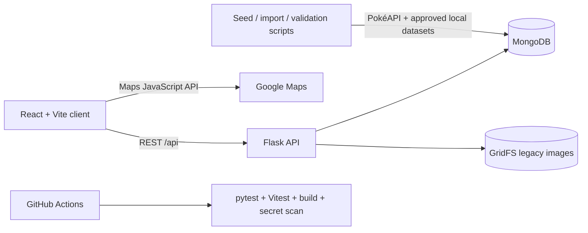
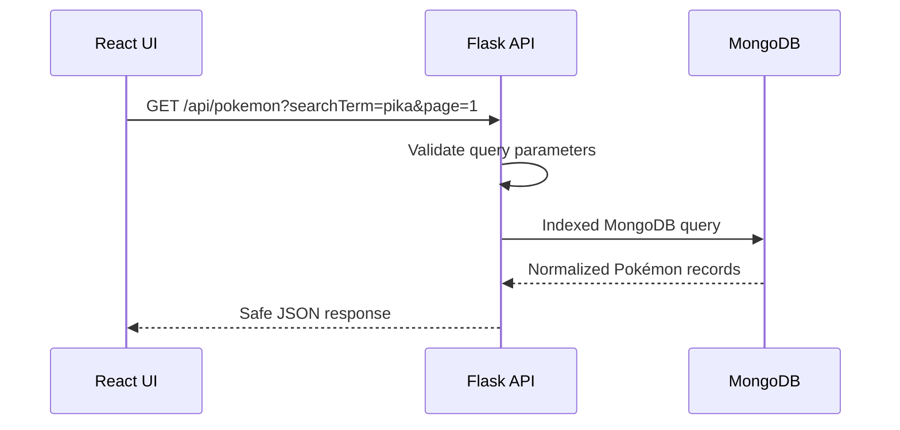
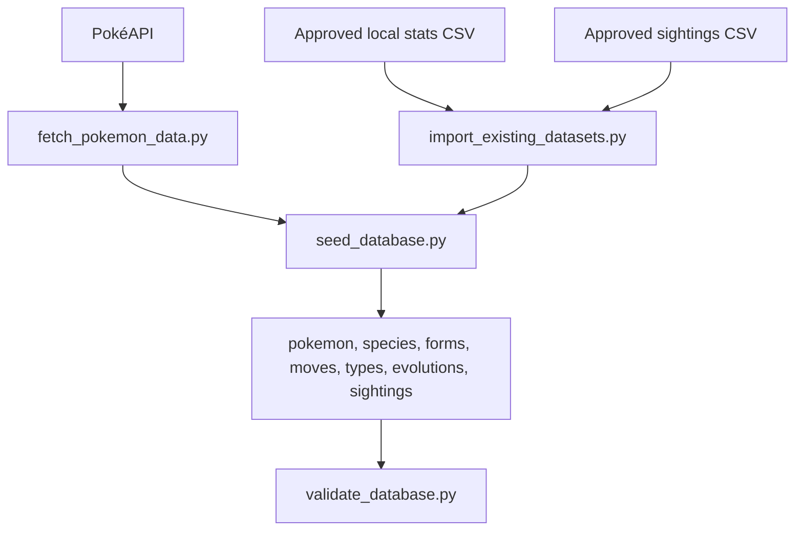
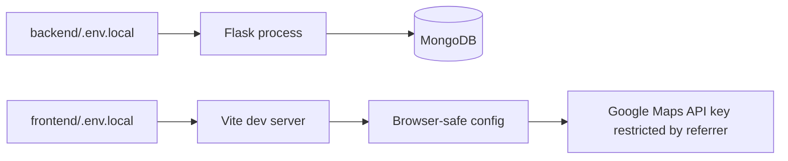

# Pokédex Atlas


Pokédex Atlas is a full-stack Pokémon exploration platform built with React, Vite, Flask, MongoDB, GridFS, Google Maps, Docker, and CI quality gates. It turns a legacy Pokémon sightings project into a polished portfolio application with a searchable Pokédex, Pokémon detail pages, sightings map, team builder, comparison tools, analytics dashboard, classic-inspired battle simulator, achievements, quizzes, and a repeatable public-data ingestion pipeline.

The application is Pokémon-inspired in tone and visual language, but engineered like a professional full-stack project: configuration is environment-based, secrets stay local, data imports are documented, API routes are validated, tests run in CI, and the README is designed so another developer or recruiter can understand the project quickly.

## Demo

Screenshots should be captured into `docs/screenshots/`. Placeholder guidance is tracked in [docs/screenshots/README.md](docs/screenshots/README.md).

| Area | Screenshot path |
| --- | --- |
| Landing page | `docs/screenshots/landing-page.png` |
| Pokédex page | `docs/screenshots/pokedex-page.png` |
| Pokémon detail page | `docs/screenshots/pokemon-detail-page.png` |
| Sightings map | `docs/screenshots/sightings-map.png` |
| Battle simulator | `docs/screenshots/battle-game.png` |
| Favorites page | `docs/screenshots/favorites-page.png` |
| Team builder | `docs/screenshots/team-builder.png` |
| Compare page | `docs/screenshots/compare-page.png` |
| Analytics dashboard | `docs/screenshots/analytics-dashboard.png` |

## Feature overview

- Pokédex-style responsive UI with a device boot sequence, page transitions, theme toggle, skeleton states, empty states, and error banners.
- Searchable, filterable canonical Pokédex with pagination, grid/list/compact views, autocomplete search, type filters, generation filters, ability filters, form filters, and stat-range filters.
- Pokémon detail pages with sprites, stats, types, abilities, move metadata, evolution data, comments, sightings preview, favorites, compare actions, and team-builder actions.
- Local-first favorites, recently viewed Pokémon, profile metrics, saved UI preferences, saved teams, battle history, and browser-only exports.
- Pokémon comparison, interactive type-effectiveness chart, and team builder with type coverage analysis and rule-based recommendations.
- General and Pokémon-specific sightings map with date filtering, radius filtering, current-location controls, marker clusters, custom canvas heatmap, hotspot summaries, and sidebar navigation.
- Classic-inspired battle simulator with active Pokémon combat, move buttons, switching, health bars, type effectiveness, speed turn order, status effects, CPU difficulty, victory/defeat states, and local battle history.
- MongoDB-backed analytics dashboard for totals, type distribution, generation distribution, stat leaders, average stats by type, physical extremes, and most-sighted Pokémon.
- Local achievements, quiz modes, explainable “Who Would Win” matchup estimates, JSON/CSV export options, and a dedicated About page.
- Repeatable data pipeline for PokéAPI enrichment, legacy dataset normalization, MongoDB indexing, and validation.
- Docker Compose developer workflow, OpenAPI/Swagger API documentation, pytest/Vitest coverage, frontend build checks, GitHub Actions CI, and tracked-file secret scanning.

## Tech stack

| Layer | Technology |
| --- | --- |
| Frontend | React 18, Vite, React Router, TanStack Query, Axios, Framer Motion, CSS custom properties |
| Backend | Flask, Flask-CORS, PyMongo, python-dotenv |
| Database | MongoDB, GridFS, GeoJSON, `2dsphere` geospatial indexes |
| APIs/data | PokéAPI, approved local Pokémon stats data, approved local sightings dataset, Google Maps JavaScript API |
| DevOps | Docker, Docker Compose, GitHub Actions |
| Testing/quality | pytest, Vitest, React server-render smoke tests, frontend production build, custom secret scanner |

## Architecture overview



### API request flow



### Data ingestion flow



### Environment variable flow



## Project structure

```text
Pok-dex/
├── backend/
│   ├── app.py
│   ├── config.py
│   ├── database.py
│   ├── openapi.py
│   ├── repositories/
│   ├── routes/
│   ├── scripts/
│   ├── serializers/
│   ├── services/
│   └── tests/
├── frontend/
│   ├── index.html
│   ├── package.json
│   ├── vite.config.js
│   └── src/
│       ├── components/
│       ├── context/
│       ├── lib/
│       ├── pages/
│       └── styles/
├── docs/
│   ├── API.md
│   ├── ARCHITECTURE.md
│   ├── DATA_PIPELINE.md
│   ├── DEVELOPER_EXPERIENCE.md
│   ├── ROADMAP.md
│   ├── UI_REDESIGN_PLAN.md
│   ├── RESUME_BULLETS.md
│   └── screenshots/
├── scripts/
│   ├── docker-dev.ps1
│   ├── secret_scan.py
│   ├── setup-local.ps1
│   └── start-local.ps1
├── docker-compose.yml
├── Makefile
└── README.md
```

## Getting started

### Prerequisites

- Node.js 20+ and npm
- Python 3.11+
- Docker Desktop
- MongoDB through Docker Compose or a local MongoDB service
- A Google Maps JavaScript API key for map pages
- Optional: approved local sightings dataset at `data/300k.csv`

### Clone and install

```powershell
git clone https://github.com/la3679/Pok-dex.git
cd Pok-dex
```

Create local-only environment files from the safe examples:

```powershell
Copy-Item backend/.env.example backend/.env.local
Copy-Item frontend/.env.example frontend/.env.local
```

Install backend and frontend dependencies:

```powershell
python -m venv .venv
.\.venv\Scripts\python.exe -m pip install -r backend\requirements.txt
npm --prefix frontend ci
```

### Environment variables

`backend/.env.local`:

```env
MONGO_URI=mongodb://localhost:27018/PokeMap
MONGO_DATABASE=PokeMap
FLASK_ENV=development
FLASK_DEBUG=true
FRONTEND_ORIGINS=http://localhost:3000,http://127.0.0.1:3000
```

`frontend/.env.local`:

```env
REACT_APP_GOOGLE_MAPS_API_KEY=
REACT_APP_API_BASE_URL=http://localhost:5000
```

The committed example files contain placeholders only:

- [backend/.env.example](backend/.env.example)
- [frontend/.env.example](frontend/.env.example)

Never commit `.env`, `.env.local`, real API keys, MongoDB credentials, private tokens, or screenshots that expose secrets.

## Google Maps API setup

Enable the Google Maps JavaScript API in Google Cloud and put the browser key only in `frontend/.env.local`:

```env
REACT_APP_GOOGLE_MAPS_API_KEY=
```

Recommended restrictions:

- Restrict by HTTP referrer, such as `http://localhost:3000/*`.
- Restrict API usage to the Maps JavaScript API required by this project.
- Do not hardcode the key in React, Flask, Docker, README files, screenshots, commits, or CI logs.

The sightings map uses a custom canvas heatmap overlay because Google removed the legacy Maps JavaScript Heatmap Layer in v3.65.

## Running locally without Docker containers for the app

Start MongoDB through Docker Compose:

```powershell
docker compose up -d mongo
```

Run the backend:

```powershell
Push-Location backend
..\.venv\Scripts\python.exe app.py
Pop-Location
```

Run the frontend:

```powershell
npm --prefix frontend run dev
```

Open:

- Frontend: `http://localhost:3000`
- Backend health: `http://localhost:5000/api/health`
- Swagger UI: `http://localhost:5000/api/docs`

PowerShell helpers are also available:

```powershell
.\scripts\setup-local.ps1
.\scripts\start-local.ps1
```

## Docker setup

Run the full stack:

```powershell
docker compose up --build
```

Stop containers:

```powershell
docker compose down
```

Reset local MongoDB volume:

```powershell
docker compose down -v
```

Tool containers:

```powershell
docker compose run --rm seed
docker compose run --rm validate
docker compose run --rm backend-test
docker compose run --rm frontend-test
docker compose run --rm frontend-build
```

PowerShell wrapper:

```powershell
.\scripts\docker-dev.ps1 up
.\scripts\docker-dev.ps1 seed
.\scripts\docker-dev.ps1 validate
.\scripts\docker-dev.ps1 test
```

More troubleshooting notes live in [docs/DEVELOPER_EXPERIENCE.md](docs/DEVELOPER_EXPERIENCE.md).

## Data setup

The rich database seed supports the full available PokéAPI catalog instead of a hardcoded Pokémon limit.

From `backend/`:

```powershell
..\.venv\Scripts\python.exe -m scripts.seed_database --skip-legacy
..\.venv\Scripts\python.exe -m scripts.validate_database
```

For a quick smoke import:

```powershell
..\.venv\Scripts\python.exe -m scripts.seed_database --skip-legacy --max-records 25
```

Expected normalized collections include:

- `pokemon`
- `pokemon_forms`
- `pokemon_species`
- `pokemon_moves`
- `pokemon_types`
- `pokemon_evolutions`
- `pokemon_sightings`
- `pokemon_comments`
- `import_logs`

The user-validated local seed produced:

| Collection | Count |
| --- | ---: |
| `pokemon` | 1,350 |
| `pokemon_species` | 1,025 |
| `pokemon_forms` | 1,673 |
| `pokemon_moves` | 937 |
| `pokemon_types` | 21 |
| `pokemon_evolutions` | 541 |
| `pokemon_sightings` | 296,021 |

Counts can change as upstream public APIs evolve. Always trust `validate_database.py` for the current local result.

### Data source and licensing notes

- PokéAPI is used for Pokémon metadata, species, forms, moves, types, evolution chains, and sprite URL references.
- Local sightings data is developer-provided and should not be redistributed by this repository unless its license permits it.
- Bulk image folders and raw datasets should not be committed unless intentionally approved and license-safe.
- The default image strategy stores safe public sprite URLs; GridFS remains available for approved legacy/local assets.

See [docs/DATA_PIPELINE.md](docs/DATA_PIPELINE.md) for the full ingestion strategy.

## API documentation

Interactive API docs are available after starting Flask:

| Documentation | URL |
| --- | --- |
| Swagger UI | `http://localhost:5000/api/docs` |
| OpenAPI JSON | `http://localhost:5000/api/docs/openapi.json` |

Main endpoints:

| Method | Endpoint | Description |
| --- | --- | --- |
| GET | `/api/health` | Service and MongoDB health |
| GET | `/api/pokemon` | Search, filter, sort, and paginate Pokémon |
| GET | `/api/pokemon/:pokemonId` | Pokémon detail record |
| GET | `/api/pokemon/:pokemonId/forms` | Forms and variants |
| GET | `/api/pokemon/:pokemonId/moves` | Move metadata |
| GET | `/api/pokemon/:pokemonId/evolutions` | Evolution-chain data |
| GET | `/api/pokemon/:pokemonId/sightings` | Pokémon-specific sightings |
| GET | `/api/sightings` | Map-ready sightings with filters |
| POST | `/api/pokemon/:pokemonId/comments` | Add a comment |
| GET | `/api/types` | Type metadata |
| GET | `/api/type-chart` | Type-effectiveness multiplier |
| GET | `/api/analytics/summary` | Collection totals |
| GET | `/api/analytics/types` | Type distribution |
| GET | `/api/analytics/top-stats` | Stat leaders |
| GET | `/api/analytics/generations` | Generation distribution |
| GET | `/api/analytics/type-stats` | Average stats by type |
| GET | `/api/analytics/extremes` | Tallest/heaviest Pokémon |
| GET | `/api/analytics/sightings` | Most-sighted Pokémon |
| GET | `/api/game/start` | Legacy battle setup |
| POST | `/api/game/turn` | Legacy battle turn |
| GET | `/api/images/:imageId` | Legacy GridFS image |

Example:

```powershell
Invoke-RestMethod "http://localhost:5000/api/pokemon?page=1&perPage=20&searchTerm=pika"
Invoke-RestMethod "http://localhost:5000/api/type-chart?attacking=electric&defending=water,flying"
```

See [docs/API.md](docs/API.md) for more examples.

## Testing and quality gates

Backend tests:

```powershell
Push-Location backend
..\.venv\Scripts\python.exe -m pytest tests -q
Pop-Location
```

Frontend tests and build:

```powershell
npm --prefix frontend run test
npm --prefix frontend run build
```

Secret scan:

```powershell
.\.venv\Scripts\python.exe scripts\secret_scan.py
```

CI runs backend tests, frontend tests, frontend production build, and the secret scan through GitHub Actions.

## Security notes

- Secrets are not required in committed files.
- `.env` and `.env.local` are ignored.
- Backend MongoDB credentials must come from environment variables.
- The Google Maps key must stay in `frontend/.env.local` and should be restricted in Google Cloud.
- The secret scanner checks tracked files for Google API key patterns, credentialed MongoDB URIs, private key blocks, and common token leaks.
- Avoid printing keys in terminal logs, browser console output, screenshots, issue text, or CI output.

## Git workflow

Recommended branch names:

- `docs/project-roadmap`
- `chore/production-cleanup`
- `chore/data-pipeline`
- `feat/pokedex-redesign`
- `feat/rich-pokemon-database`
- `feat/battle-redesign`
- `feat/sightings-map-upgrade`
- `feat/analytics-dashboard`
- `test/add-ci-coverage`
- `ci/github-actions`

Use Conventional Commits:

- `feat: add pokemon comparison page`
- `fix: remove hardcoded google maps api key`
- `docs: rewrite readme with professional project documentation`
- `test: add backend route tests`
- `ci: add github actions workflow`

Before a pull request:

- Run backend tests.
- Run frontend tests and build.
- Run the secret scan.
- Confirm `.env.local`, raw datasets, build folders, virtual environments, and large image dumps are not staged.
- Update README/docs when setup, API, data, testing, Docker, or architecture behavior changes.

## Roadmap

All planned implementation phases are now complete in the current working tree:

| Phase | Status | Outcome |
| --- | --- | --- |
| 0 | Complete | Audit, roadmap, architecture, UI, data, contribution docs |
| 1 | Complete | Secure environment configuration and health check |
| 2 | Complete | Rich PokéAPI-first data pipeline |
| 3 | Complete | Modular backend and expanded API |
| 4 | Complete | Full Pokédex UI redesign |
| 5 | Complete | Favorites, recent views, and local profile |
| 6 | Complete | Compare, type chart, and team builder |
| 7 | Complete | Classic-inspired battle redesign |
| 8 | Complete | Sightings map redesign and custom heatmap |
| 9 | Complete | Analytics dashboard |
| 10 | Complete | Achievements, quiz, matchup estimator, exports |
| 11 | Complete | Tests, CI, build, and secret scan |
| 12 | Complete | Docker and developer experience |
| 13 | Complete | OpenAPI and Swagger docs |
| 14 | Complete | Professional README and portfolio polish |

## Known limitations

- Google Maps requires a local browser key, and that key must be restricted by the developer.
- PokéAPI enrichment depends on upstream availability and current API data.
- Local sightings data must be provided by the developer and validated for license-safe use.
- Some legacy image and battle endpoints remain for compatibility while the redesigned frontend uses richer local logic.
- Browser-local features are intentionally not synced across devices because authentication is not implemented.
- Docker builds require Docker Desktop access from the user’s terminal; some sandboxed environments cannot access the Docker Engine pipe.
- No project license has been selected yet.

## Resume and portfolio highlights

- Modernized a legacy full-stack app into a polished Pokédex platform with React, Flask, MongoDB, Docker, and CI.
- Designed a repeatable data ingestion pipeline for public API enrichment, local dataset normalization, MongoDB indexes, and validation.
- Built recruiter-visible product features: searchable Pokédex, detail pages, map exploration, analytics dashboard, team builder, comparison tools, and battle simulator.
- Implemented MongoDB geospatial queries, aggregation pipelines, GridFS compatibility, OpenAPI docs, and secure environment-based configuration.
- Added automated quality gates with pytest, Vitest, production build checks, GitHub Actions, and tracked-file secret scanning.

More tailored bullets are available in [docs/RESUME_BULLETS.md](docs/RESUME_BULLETS.md).

## License

No project license has been specified yet. Add a license before distributing, deploying publicly, or accepting external contributions. Dataset and sprite attribution requirements should be reviewed against each source’s current terms before publication.
