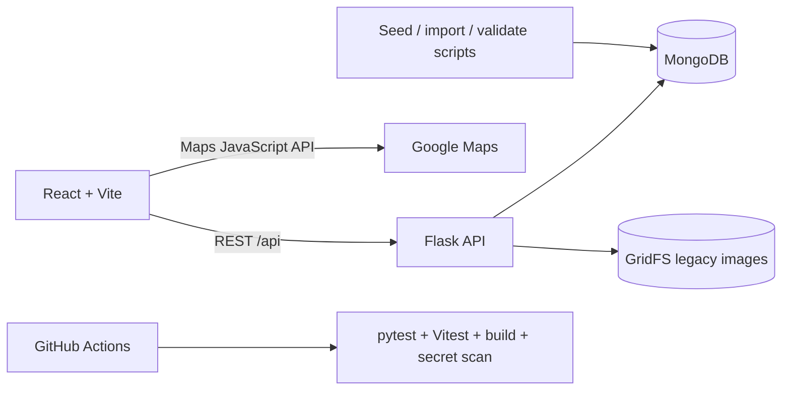
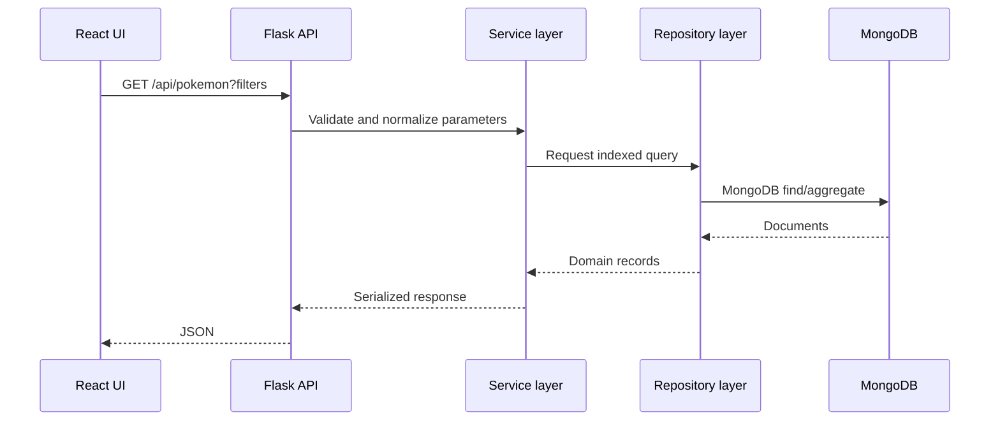
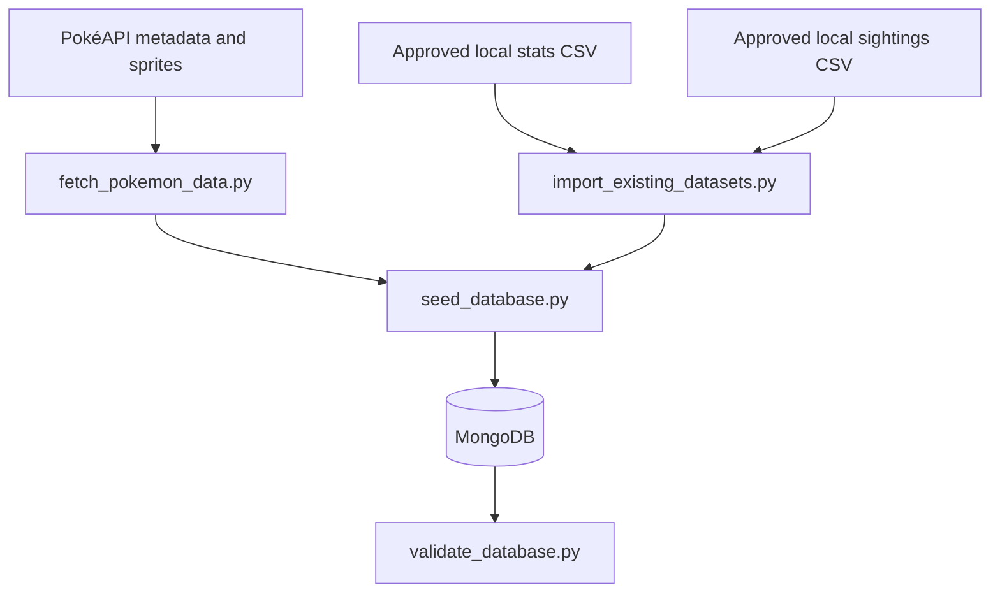
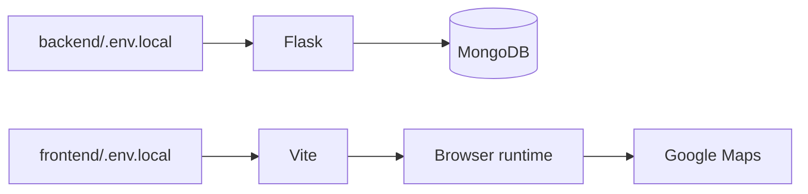

# Architecture

Pokédex Atlas is a React/Vite client backed by a Flask API and MongoDB. The app is intentionally local-development friendly while still demonstrating production-style separation of concerns, environment configuration, data ingestion, API validation, and quality gates.

## System overview

## Frontend responsibilities

- Route-driven React app with pages for the landing experience, Pokédex, detail records, favorites, recent views, profile, compare, type chart, team builder, sightings map, battle, analytics, achievements, quiz, matchup estimator, and about page.
- TanStack Query and Axios handle API reads.
- Browser local storage handles favorites, recently viewed Pokémon, teams, preferences, battle history, achievements, and exports.
- Google Maps is loaded only where needed, using `REACT_APP_GOOGLE_MAPS_API_KEY` from `frontend/.env.local`.
- The heatmap mode uses a custom canvas overlay because Google removed the legacy Heatmap Layer from the Maps JavaScript API.

## Backend responsibilities

- Flask app factory in `backend/app.py`.
- Routes in `backend/routes/`.
- Business rules in `backend/services/`.
- MongoDB query boundaries in `backend/repositories/`.
- Response shaping in `backend/serializers/`.
- Input validation in `backend/services/validation.py`.
- API contract in `backend/openapi.py`, served through `/api/docs/openapi.json` and `/api/docs`.

## MongoDB collections

| Collection | Purpose |
| --- | --- |
| `pokemon` | Canonical browseable Pokémon records and battle-ready stats |
| `pokemon_species` | Species metadata, generation, capture rate, legendary/mythical flags |
| `pokemon_forms` | Form and variant records |
| `pokemon_moves` | Move metadata used by detail and battle features |
| `pokemon_types` | Type metadata and damage relations |
| `pokemon_evolutions` | Evolution-chain data |
| `pokemon_sightings` | GeoJSON sightings with geospatial indexes |
| `pokemon_comments` | User comments separated from canonical records |
| `import_logs` | Resumable import checkpoints and source metadata |
| `images.files` / `images.chunks` | Legacy GridFS image support |

## API request flow

## Data ingestion flow

## Image and GridFS flow

The preferred strategy is to store safe public sprite URLs from PokéAPI. GridFS remains for legacy/local assets when they are intentionally imported and license-safe. Large image dumps should not be committed.

## Environment flow

- `backend/.env.local` supplies `MONGO_URI`, `MONGO_DATABASE`, Flask settings, and allowed frontend origins.
- `frontend/.env.local` supplies `REACT_APP_API_BASE_URL` and `REACT_APP_GOOGLE_MAPS_API_KEY`.
- Example files contain placeholders only.
- Real keys and credentials stay local.

## Local development flow

Docker can run only MongoDB for the fastest native Windows workflow, or it can run MongoDB, Flask, and Vite together for full-stack container verification. Tool containers provide repeatable seed, validation, backend-test, frontend-test, and frontend-build commands.
