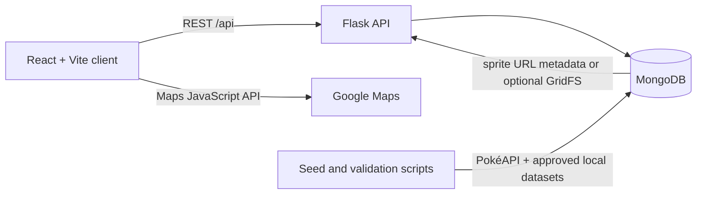
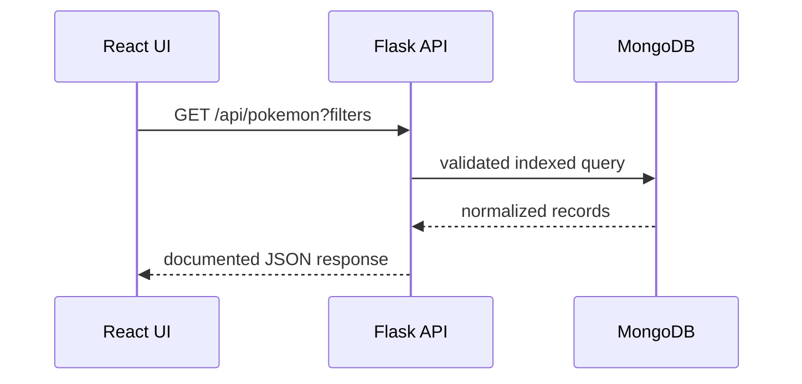
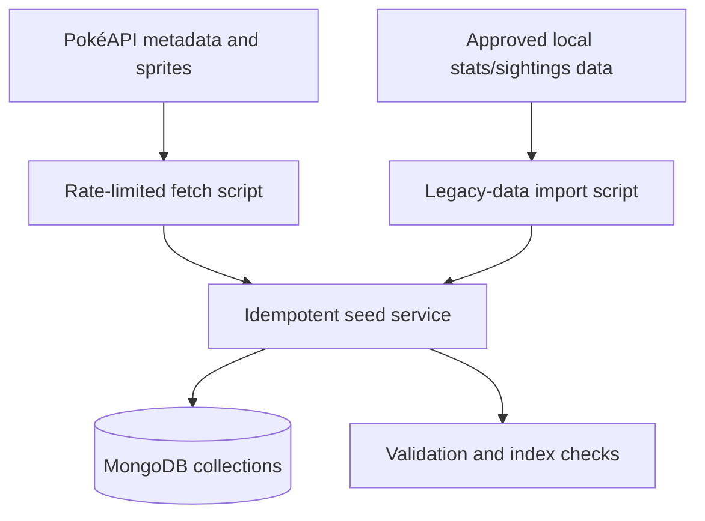

# Architecture

## Current state

The current React client calls Flask directly. Flask reads the `MergedPokemonSightings` collection and GridFS image files from MongoDB. Google Maps JavaScript is loaded only on the sightings page. The dataset importer merges Pokémon stats, local sprites, and sightings into one document per Pokémon with sightings.

## Target architecture

## API request flow

## Data ingestion flow

## Target MongoDB responsibilities

- `pokemon`: canonical browseable entries and battle-ready stats.
- `pokemon_species`, `pokemon_forms`, `pokemon_moves`, `pokemon_types`, `pokemon_evolutions`: normalized enrichment data.
- `pokemon_sightings`: geospatial, date-filterable external sightings.
- `pokemon_comments`: user comments separated from canonical Pokémon records.
- `import_logs`: resumable pipeline checkpoints and source metadata.

Sprites will default to documented source URLs. GridFS remains optional for deliberately imported local assets; bulk images will not be committed.

## Environment flow

`backend/.env.local` supplies server-only local configuration. `frontend/.env.local` supplies the browser-safe API base URL and restricted Google Maps key. Both files are ignored. Example files document only placeholders. Docker development uses a non-production local MongoDB service; deployed credentials are never committed.

## Local development flow

Docker runs MongoDB; Flask and the React client can run locally or in later container services. The seed workflow is deliberate and repeatable rather than an application-start side effect.
